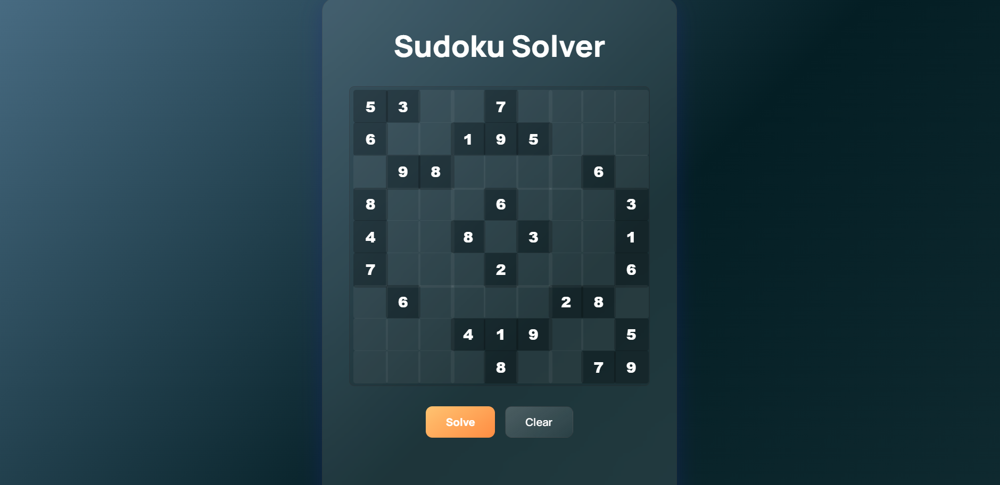
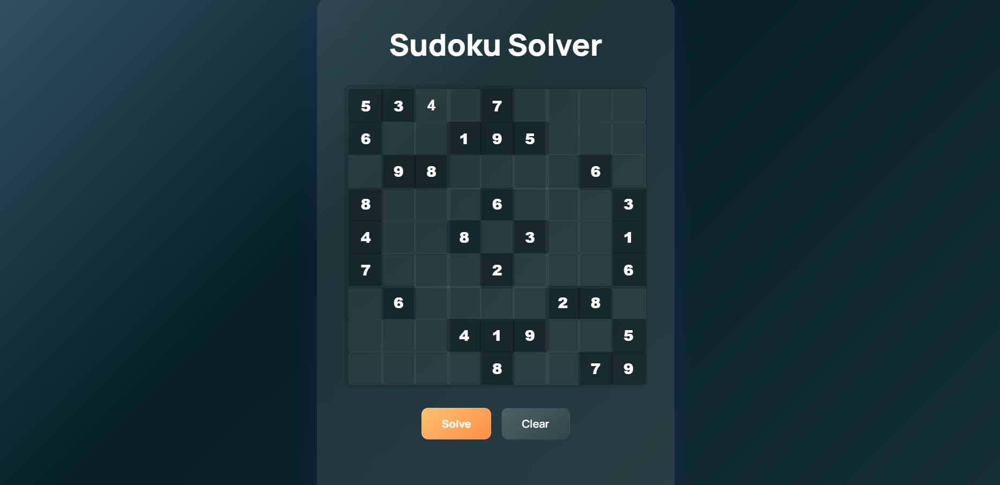
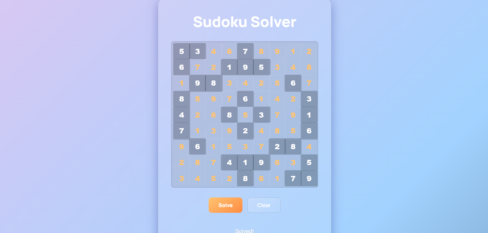
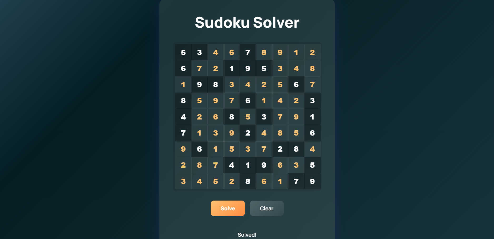
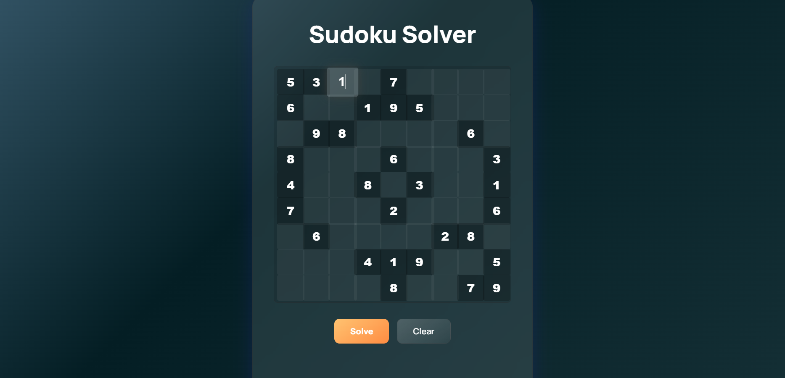
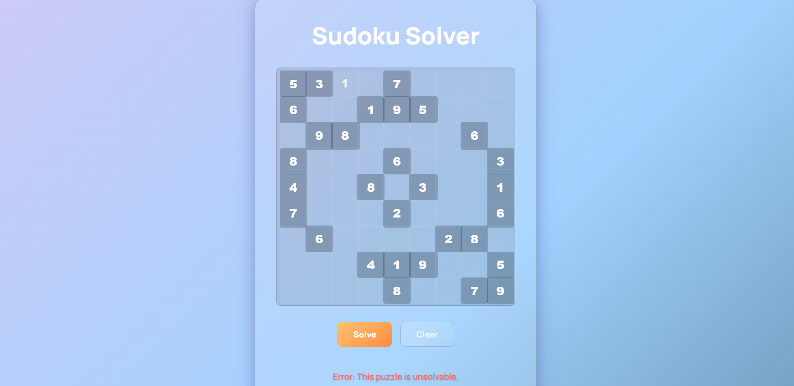

# SCT_SD_3
Sudoku Solver using Python 
# SCT_SD_3 – Sudoku Solver using Python 🧩

This is my submission for **Task 3** of the SkillCraft Internship.  
It is a Python-based program that **automatically solves Sudoku puzzles** using the **backtracking algorithm**.

---

## 🚀 Features
- Solves any 9x9 Sudoku puzzle using recursion and constraint checking
- Simple frontend using `index.html`
- Python backend (`app.py`) for algorithmic logic

---

## 🧠 Tech Stack
- Python
- HTML/CSS (basic UI)
- Backtracking algorithm

---

## 🖼️ Demo Screenshot






---

## ▶️ How to Run

1. Clone this repository:
   ```bash
   git clone https://github.com/Devikaraji/SCT_SD_3.git
